### Hey ，I’m Rento

<table>
<tr>
<td valign="center"  width="30%">
  
- 🤖 我最喜欢的动漫：双城之战
- 👨‍💻 我了解Golang、Node.js、Java、React、Vue、Uni APP、React Native、Unity(C#)等等...
- ✍️ [欢迎参观我的博客](https://blog.caihongtu.top/)
- 💬 保持思考
- 📫 联系我: [邮箱联系](mailto:putongruwo@outlook.com)
- 👏 关注我: 
- 🎣 兴趣：读[阮一峰的网络日志](https://www.ruanyifeng.com/blog/)，写[自己的博客](https://blog.caihongtu.top/)，刷[Youtube](https://www.youtube.com/@caihongtu)  
**「天天开心」** ❤️
</td>
<td valign="center" width="100%" height="100%">

</td>
</tr>
</table>

🏆 **我的 GitHub 统计信息:**

|||
||-|

<table>
<tr>
<td valign="center"  width="50%">

#### 🐍 贡献
<picture>
  <source media="(prefers-color-scheme: dark)" srcset="https://raw.githubusercontent.com/rento666/rento666/output/github-contribution-grid-snake-dark.svg">
  <source media="(prefers-color-scheme: light)" srcset="https://raw.githubusercontent.com/rento666/rento666/output/github-contribution-grid-snake.svg">
  
</picture>

</td>
<td valign="center"  width="50%">

📕 &nbsp;[**我的最新博客**](https://cai-hong-tu-blog.pages.dev/)
<!-- BLOG-POST-LIST:START -->
<a href="https://blog.caihongtu.top/post/2026/day001/">日常记录之QClaw初尝试&amp;桌面整理工具推荐 2026-04-12</a>

<a href="https://blog.caihongtu.top/post/2026/stack/">技术栈推荐 2026-04-09</a>

<a href="https://blog.caihongtu.top/post/2026/glados-checkin/">利用 Cloudflare Workers 实现 Glados 自动签到 2026-04-05</a>

<a href="https://blog.caihongtu.top/post/2026/create-npm-package-frist/">创建第一个npm包 2026-03-29</a>

<a href="https://blog.caihongtu.top/post/2026/html-as-ppt-by-ai/">使用coze AI生成PPT式HTML 2026-03-25</a>
<!-- BLOG-POST-LIST:END -->

</td>
</tr>
</table>
